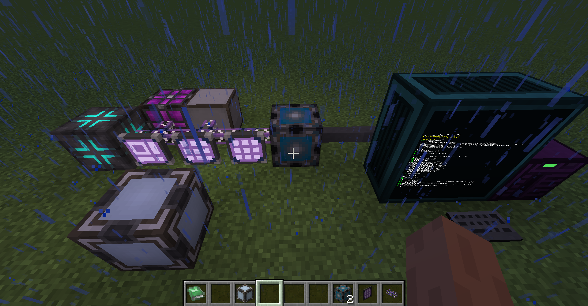
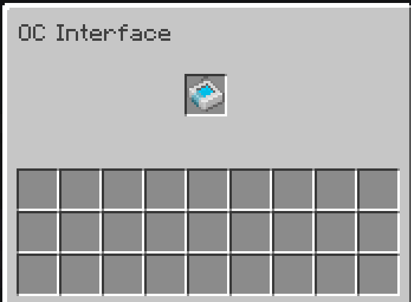
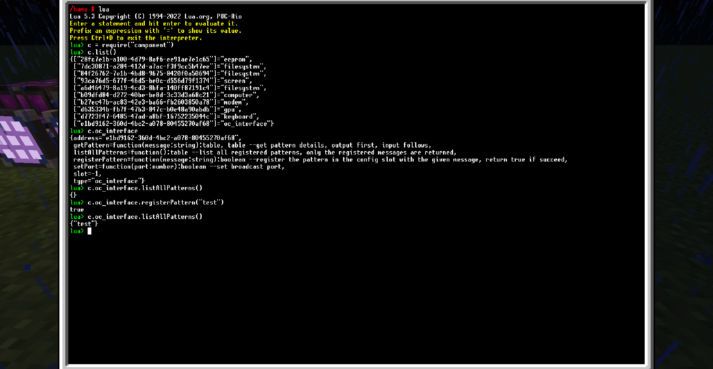
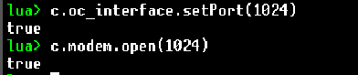
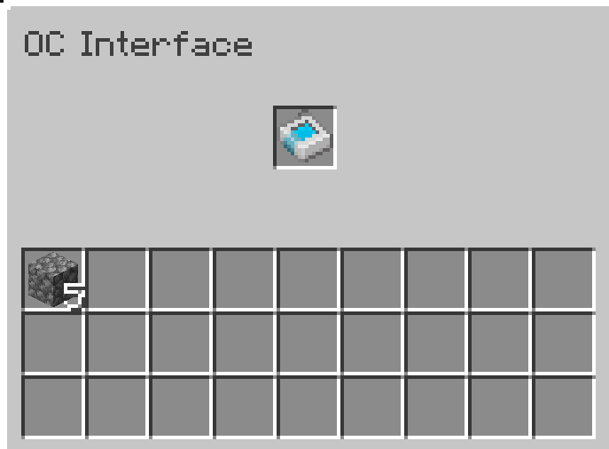

First, connect OC interface with both an AE2 network and an OpenComputers network.  
  
Then, put an encoded pattern in its config slot.  
  
Use lua script to configure the pattern.  
  
Don't forget to set broadcast port and open that port on modem.  
  
Then, when the pattern is used by AE2 network, the interface automatically broadcast a
message with the content "test" on port 1024.  

You can use all sorts of methods to make use of this message. Here's an example.
  

Note that the ingredient will be send to inventory inside the interface, rather than pushed
to containers nearby. Besides, the top side of the interface is connected to config slot, while
others are connected to the inventory for AE2 ingredient.

