Block Controller is a ultra-upgraded version of transposer, it allows manipulation over
adjacent blocks' inventories the same as the transposer. But it allows access the inventories
in different side(their own side, not the side of the block controller), and it allows inter-controller
ItemStack transfer, which is achieved with the help of ME switching card.  

And ME switching card for now is the lua api for manipulating block controller, but in reality it's 
an api for manipulating storage system.

***

First, we need a oc network(or call it machine) and put both of them into the network.
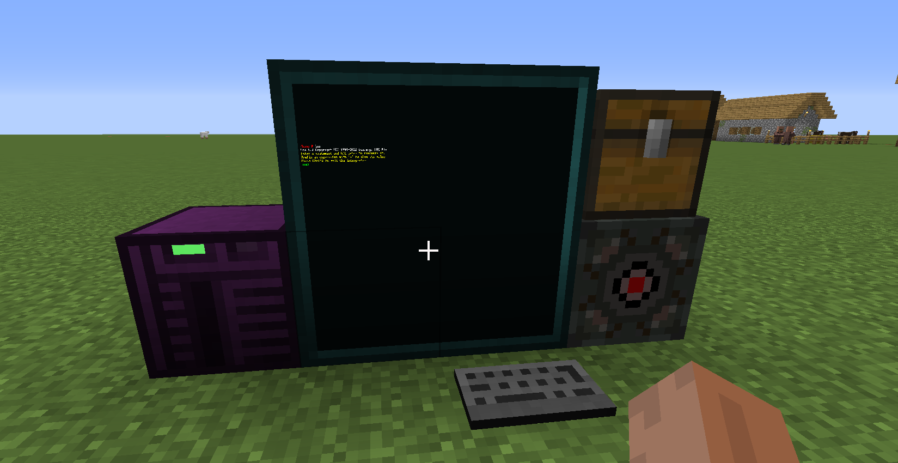  
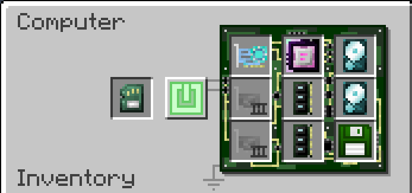  
And we get their respective component object.  
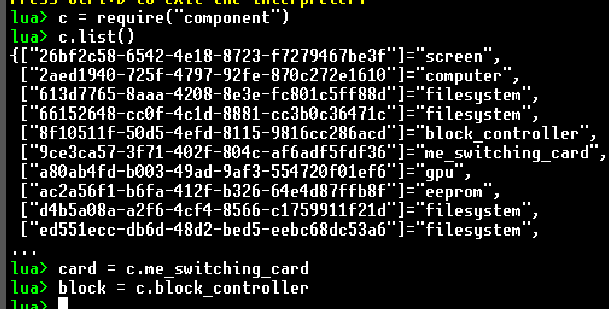

Then, let's talk about storage system. It's an abstraction and sort of a protocol the switching
card uses and follows. From the card's perspective, it treat the block controller as a gigantic
chest which has numerous slots(or indexes). I'll just stop here, you can find more detained description
in docs about storage system, if you are interested.

So, the block controller actually merges the inventories beside it into that gigantic chest.
But how? It does it by maintaining a map, from indexes in storage system to actual slots in adjacent
inventories. And that's what its `map()` and `unmap()` methods do, to add or remove entries.

So lets do it. We map the `0` to `("up", "down", 1)` and `1` to `("up", "down", 10)`. And we can check
what's inside the map by using `getMapping()`.

Note that the first "up" indicates the block on the up side of the controller, and the second "down"
indicates the bottom side of the upper block, finally the 1 means the second slot in the chest.  

The six possible strings are `{"up", "down", "west", "east", "south", "north"}`.

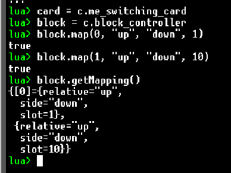  
Here's what's inside the chest now.
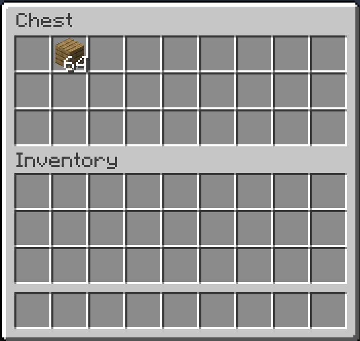  

Now we use the switching card to manipulate this chest.  

First we push 32 items from index 0 into the card.  
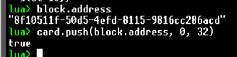  
And we can see that 32 oak planks do disappeared.  
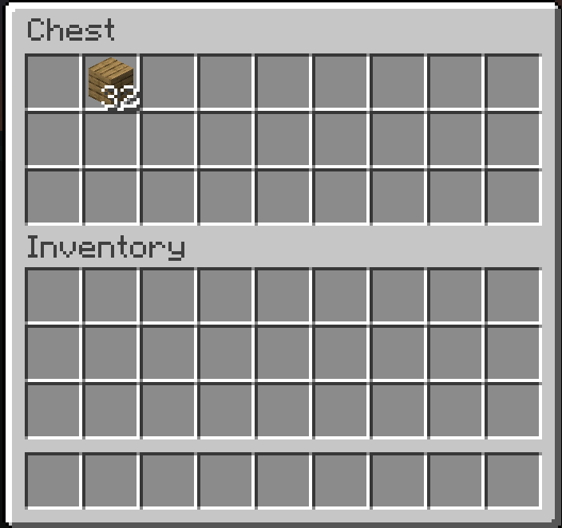  

Try peeking the top.
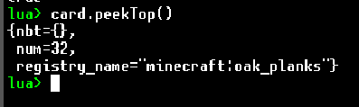

Then let's pop it out.  
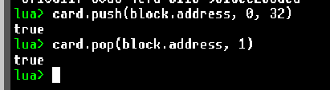  
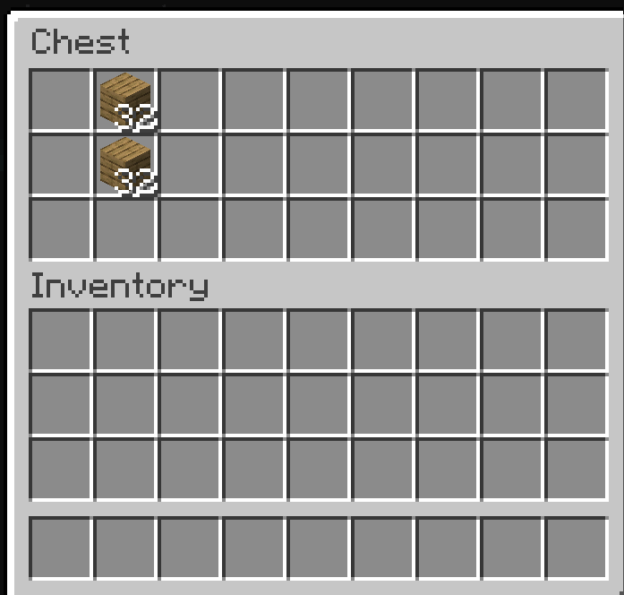  

And try peeking it.
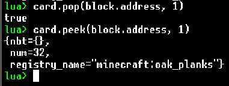

And that's all. For more detailed behaviour, check the doc plz.
