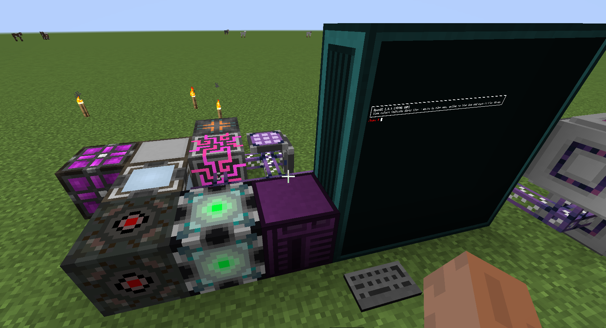
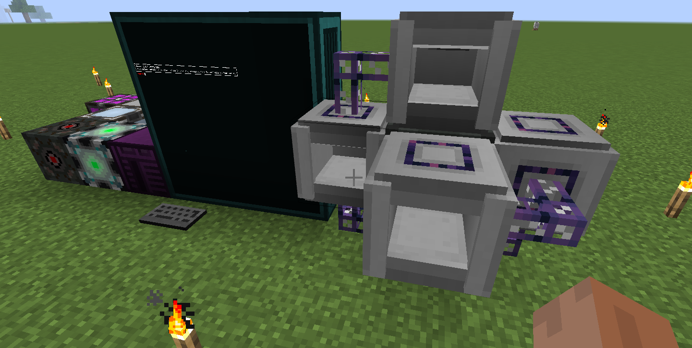
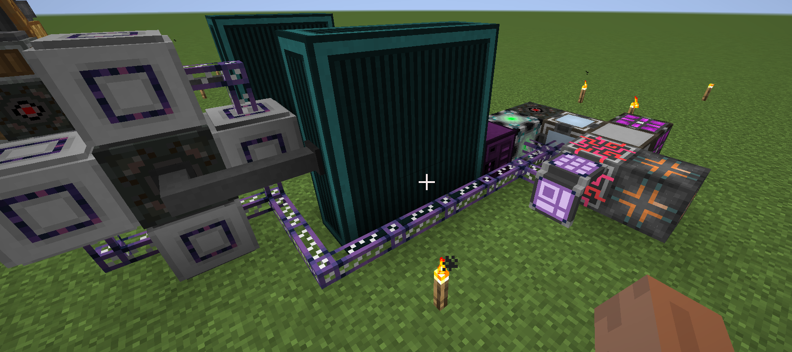
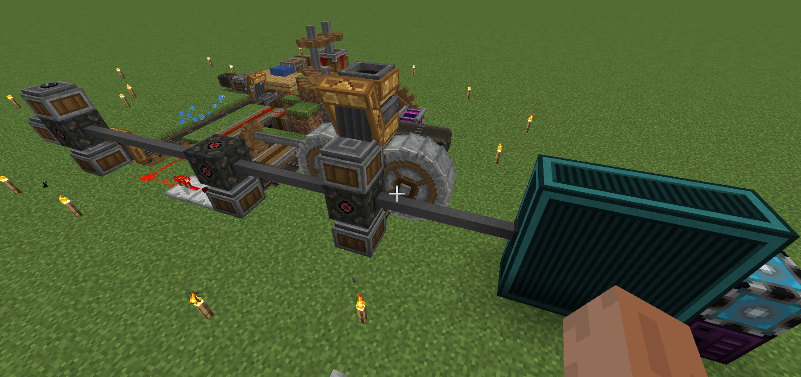

With version 1.2.0, we present OE interface and the lua software used with it:
oecore and oemm. The former is a block and the two latter are added to game in the
form of oc disks, found in AE2 meteorite chests. 

---

### OE Interface

First let's talk about the OE interface. It's quite similar to OC interface, in the sense
of connecting AE2 network and OC network. For a schematic perspective, both of them have
an inventory for AE2 crafting patterns and an inventory to cache ingredients needed for 
conducting the crafting. But for OE interface, only the crafting pattern inventory is exposed,
yet without GUI, and whether the inventory is empty or not will be indicated by the texture.
And what about the second inventory? It's completely hidden, and can only be accessed using
ME switching card, through the *Storage System* interface. Apart from that, the inventory 
also differs from the standard chest-like inventories because it's now a linked list, in which
each node represent a call on a crafting pattern, and every ingredient involved in that call
will be stored in that very node. 

And how do we reconcile the linked list and the storage system interface? This is achieved with
two internal counter, called `sequence head` and `sequence tail`. If you're familiar with the 
TCP protocol, you definitely know the sliding window protocol, which is what we use here. both 
counters start at 0, and the tail keeps increasing whenever a crafting call is made by AE2 network.
Obviously, we can't have that happen unlimitedly, so we have a max size for the linked list, 
once it's reached, we just stop to accept calls from AE2. Then, you see, at any given time, the
sequence head and tail form an interval(or a window), only the slot index inside this interval
is valid and can be used to access the linked list. Then, we have to shift the window: whenever
the first node is empty(all ingredients are pulled), the window will be shifted by *1 node*. 
By shifting I mean the mapping on shifted nodes are removed and more crafting calls are allowed 
to happen. Do note that during a OE interface's lifetime, a slot index is will only be used and
removed once, either you access the right ingredient or you get an index out of range exception.

Lastly, on how to use it. It's basically the same as the [OC interface](../v1.0.0/tutorial.md).

First, connect it to both AE and OC network, then put crafting patterns inside it and configure
through OC callbacks. Then, whenever it receives a crafting call, it first arranges the linked
list and sequence head&tail, then sends a network packet to OC network, with the very message you
configured. Everything is the same as the OC interface, but instead of only the messages configured,
it will also provide you with the exact head and tail in which the related ingredients locate, and
you can use them to retrieve ingredients.

---

### OpenEnergistics' Machine Manager(OEMM)
Just a machine manager, read the code yourself.  

---

### OpenEnergistics Core(OECore)
A software used with OE interface to allow you leverage OC computers as a crafting
subnet of AE2. See [this](../../doc/OpenEnergistics/OpenEnergistics.md) for details.
Read the code yourself as well.  

There are currently two code sample in the disk:
* /etc/oecore/crafting/ae_chips.lua
* /etc/oecore/line/iron_farm.lua

The first one implement the crafting of AE2 chips, you can find detailed instructions to make it 
to work inside it. And it only requires OECore to run.  Here's a possible configuration:
  
  
  

The second one is a virtual assembly line, which uses *Create* machines to produce iron nuggets and
flint out of nothing. You would need both OECore and OEMM, so make sure you have them installed.
And, a possible configuration too:
  

<b>To start OE</b>: first `cd /etc/oecore` then `init` or `lua init.lua`  